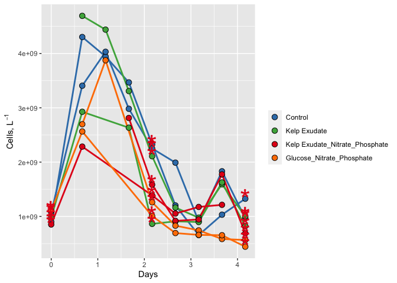
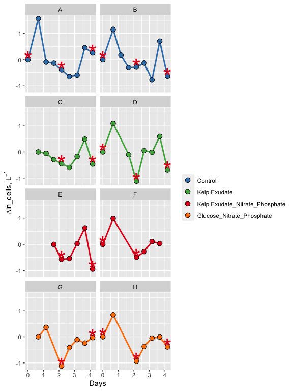
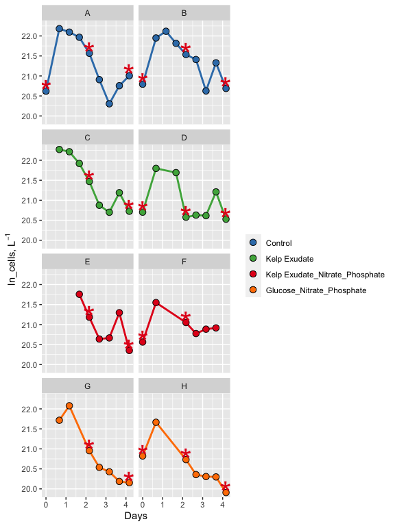

101821\_2021\_abundance\_demo
================

# Goal

This document shows how **individual bottle** bacterial abundance data
from 2018 remineralization experiments were processed, QC’d and
analyzed. It also provides an intro to data processing and analysis with
RStudio and R Markdown.

\#Intro to R Markdown

Create a new code chunk: Shortcut for Mac: Command + option + i

Load packages that we’ll need to analyze our data

``` r
library(tidyverse)
library(readxl)
library(lubridate)
```

We can toggle on/off warnings in chunks if we don’t want them in our
final markdown file.

\#Import Data

``` r
excel_sheets("~/test project/EEMB 144L/144l_students_2021/Input_Data/week4/144L_2021_BactAbund.xlsx")
```

    ## [1] "Metadata" "Data"

``` r
#make comments using pound sign

metadata <- read_excel("~/test project/EEMB 144L/144l_students_2021/Input_Data/week4/144L_2021_BactAbund.xlsx", sheet = "Metadata")

glimpse(metadata)
```

    ## Rows: 80
    ## Columns: 16
    ## $ Experiment           <chr> "144L_2021", "144L_2021", "144L_2021", "144L_2021…
    ## $ Location             <chr> "Goleta Pier", "Goleta Pier", "Goleta Pier", "Gol…
    ## $ Temperature          <dbl> 19, 19, 19, 19, 19, 19, 19, 19, 19, 19, 19, 19, 1…
    ## $ Depth                <dbl> 1, 1, 1, 1, 1, 1, 1, 1, 1, 1, 1, 1, 1, 1, 1, 1, 1…
    ## $ Bottle               <chr> "A", "A", "A", "A", "A", "A", "A", "A", "A", "A",…
    ## $ Timepoint            <dbl> 0, 1, 2, 3, 4, 5, 6, 7, 8, 9, 0, 1, 2, 3, 4, 5, 6…
    ## $ Treatment            <chr> "Control", "Control", "Control", "Control", "Cont…
    ## $ Target_DOC_Amendment <dbl> 0, 0, 0, 0, 0, 0, 0, 0, 0, 0, 0, 0, 0, 0, 0, 0, 0…
    ## $ Inoculum_L           <dbl> 2, 2, 2, 2, 2, 2, 2, 2, 2, 2, 2, 2, 2, 2, 2, 2, 2…
    ## $ Media_L              <dbl> 5, 5, 5, 5, 5, 5, 5, 5, 5, 5, 5, 5, 5, 5, 5, 5, 5…
    ## $ Datetime             <chr> "2021-10-04T16:00", "2021-10-05T08:00", "2021-10-…
    ## $ TOC_Sample           <lgl> TRUE, FALSE, FALSE, FALSE, TRUE, FALSE, FALSE, FA…
    ## $ Cell_Sample          <lgl> TRUE, TRUE, TRUE, TRUE, TRUE, TRUE, TRUE, TRUE, T…
    ## $ DAPI_Sample          <lgl> TRUE, FALSE, FALSE, FALSE, TRUE, FALSE, FALSE, FA…
    ## $ DNA_Sample           <lgl> TRUE, FALSE, FALSE, FALSE, TRUE, FALSE, FALSE, FA…
    ## $ Nutrient_Sample      <lgl> TRUE, FALSE, FALSE, FALSE, FALSE, FALSE, FALSE, F…

``` r
#unique(metadata$Bottle)

data <- read_excel("~/test project/EEMB 144L/144l_students_2021/Input_Data/week4/144L_2021_BactAbund.xlsx", sheet = "Data")

joined <- left_join(metadata, data) #attach data to metadata
```

    ## Joining, by = c("Bottle", "Timepoint")

``` r
#joined right dataset to left one by using variables that are the same across two dataframes
glimpse(joined)
```

    ## Rows: 80
    ## Columns: 19
    ## $ Experiment           <chr> "144L_2021", "144L_2021", "144L_2021", "144L_2021…
    ## $ Location             <chr> "Goleta Pier", "Goleta Pier", "Goleta Pier", "Gol…
    ## $ Temperature          <dbl> 19, 19, 19, 19, 19, 19, 19, 19, 19, 19, 19, 19, 1…
    ## $ Depth                <dbl> 1, 1, 1, 1, 1, 1, 1, 1, 1, 1, 1, 1, 1, 1, 1, 1, 1…
    ## $ Bottle               <chr> "A", "A", "A", "A", "A", "A", "A", "A", "A", "A",…
    ## $ Timepoint            <dbl> 0, 1, 2, 3, 4, 5, 6, 7, 8, 9, 0, 1, 2, 3, 4, 5, 6…
    ## $ Treatment            <chr> "Control", "Control", "Control", "Control", "Cont…
    ## $ Target_DOC_Amendment <dbl> 0, 0, 0, 0, 0, 0, 0, 0, 0, 0, 0, 0, 0, 0, 0, 0, 0…
    ## $ Inoculum_L           <dbl> 2, 2, 2, 2, 2, 2, 2, 2, 2, 2, 2, 2, 2, 2, 2, 2, 2…
    ## $ Media_L              <dbl> 5, 5, 5, 5, 5, 5, 5, 5, 5, 5, 5, 5, 5, 5, 5, 5, 5…
    ## $ Datetime             <chr> "2021-10-04T16:00", "2021-10-05T08:00", "2021-10-…
    ## $ TOC_Sample           <lgl> TRUE, FALSE, FALSE, FALSE, TRUE, FALSE, FALSE, FA…
    ## $ Cell_Sample          <lgl> TRUE, TRUE, TRUE, TRUE, TRUE, TRUE, TRUE, TRUE, T…
    ## $ DAPI_Sample          <lgl> TRUE, FALSE, FALSE, FALSE, TRUE, FALSE, FALSE, FA…
    ## $ DNA_Sample           <lgl> TRUE, FALSE, FALSE, FALSE, TRUE, FALSE, FALSE, FA…
    ## $ Nutrient_Sample      <lgl> TRUE, FALSE, FALSE, FALSE, FALSE, FALSE, FALSE, F…
    ## $ all_cells_uL         <chr> "901.48904752420799", "4302.9300548457404", "3944…
    ## $ LNA_cells_uL         <chr> "653.047184033284", "768.27893058466896", "937.24…
    ## $ HNA_cells_uL         <chr> "248.441863490923", "3534.65112426107", "3007.701…

\#Prepare Data for Plotting

We will convert the Date and Time column values from characters to
dates, add columns with time elapsed for each treatment and convert data
to cells/L because it will help us match up with the TOC data later. We
will then subset the data for variables of interest and drop NA values.

To do this, we are going to be using **piping**. Piping is an operation
that allows us to write more efficint code. The way that we’ll use it
here is to manipulate our data sequentially. The pipe operator “%&gt;%”,
which basically says like “first do one thing to the data THEN do this
other thing.” Every call that we invoke with an additional pipe is going
to take place on the variable (dataframe) that we specifcy at the
beginning.

``` r
cells <- joined %>% 
  mutate(Datetime = ymd_hm(Datetime), #splits apart Datetime as specified: years, months, days _ hours, minutes
         cells_L = as.numeric(all_cells_uL) *1000000) %>% 
  group_by(Treatment, Bottle) %>%
#group our dataset so that we can calculate the time elapsed properly; group by date first then by bottle
mutate(interv= interval(first(Datetime), Datetime),
       s = as.numeric(interv),
       hours = s/3600,
       days = hours/24) %>%
  ungroup() %>%
  select(Experiment:DNA_Sample, cells_L, hours, days) %>% 
  drop_na(cells_L)
          glimpse(cells)
```

    ## Rows: 60
    ## Columns: 18
    ## $ Experiment           <chr> "144L_2021", "144L_2021", "144L_2021", "144L_2021…
    ## $ Location             <chr> "Goleta Pier", "Goleta Pier", "Goleta Pier", "Gol…
    ## $ Temperature          <dbl> 19, 19, 19, 19, 19, 19, 19, 19, 19, 19, 19, 19, 1…
    ## $ Depth                <dbl> 1, 1, 1, 1, 1, 1, 1, 1, 1, 1, 1, 1, 1, 1, 1, 1, 1…
    ## $ Bottle               <chr> "A", "A", "A", "A", "A", "A", "A", "A", "A", "B",…
    ## $ Timepoint            <dbl> 0, 1, 2, 3, 4, 5, 6, 7, 8, 0, 1, 2, 3, 4, 5, 6, 7…
    ## $ Treatment            <chr> "Control", "Control", "Control", "Control", "Cont…
    ## $ Target_DOC_Amendment <dbl> 0, 0, 0, 0, 0, 0, 0, 0, 0, 0, 0, 0, 0, 0, 0, 0, 0…
    ## $ Inoculum_L           <dbl> 2, 2, 2, 2, 2, 2, 2, 2, 2, 2, 2, 2, 2, 2, 2, 2, 2…
    ## $ Media_L              <dbl> 5, 5, 5, 5, 5, 5, 5, 5, 5, 5, 5, 5, 5, 5, 5, 5, 5…
    ## $ Datetime             <dttm> 2021-10-04 16:00:00, 2021-10-05 08:00:00, 2021-1…
    ## $ TOC_Sample           <lgl> TRUE, FALSE, FALSE, FALSE, TRUE, FALSE, FALSE, FA…
    ## $ Cell_Sample          <lgl> TRUE, TRUE, TRUE, TRUE, TRUE, TRUE, TRUE, TRUE, T…
    ## $ DAPI_Sample          <lgl> TRUE, FALSE, FALSE, FALSE, TRUE, FALSE, FALSE, FA…
    ## $ DNA_Sample           <lgl> TRUE, FALSE, FALSE, FALSE, TRUE, FALSE, FALSE, FA…
    ## $ cells_L              <dbl> 901489048, 4302930055, 3944945700, 3467546844, 23…
    ## $ hours                <dbl> 0, 16, 28, 40, 52, 64, 76, 88, 100, 0, 16, 28, 40…
    ## $ days                 <dbl> 0.0000000, 0.6666667, 1.1666667, 1.6666667, 2.166…

\#Plot Growth Curves

We will plot a growth curve for each bottle. Need cell abundance and
days data.

First, let’s set some aesthetics for our plot.

``` r
#assign hex colors to our different treatments
custom.colors <- c("Control" = "#377EB8", "Kelp Exudate" = "#4DAF4A", "Kelp Exudate_Nitrate_Phosphate" = "#E41A1C", "Glucose_Nitrate_Phosphate" = "#FF7F00")

#assign levels to control what order things appear in the legend 
levels <- c("Control", "Kelp Exudate", "Kelp Exudate_Nitrate_Phosphate", "Glucose_Nitrate_Phosphate")

#now let's use a handy package, ggplot to visualize our data

cells %>% 
  mutate(dna = ifelse(DNA_Sample == T, "*", NA)) %>%
  ggplot(aes(x=days, y=cells_L, group = interaction(Treatment, Bottle))) + 
  geom_line(aes(color = factor(Treatment, levels= levels)), size = 1)+
  geom_point(aes(fill = factor(Treatment, levels = levels)), size = 3, color = "black", shape = 21) +
  geom_text(aes(label = dna), size = 12, color = "#E41A1C") +
  labs(x= "Days", y= expression(paste("Cells, L"^-1)), fill = "") + 
  guides(color = "none") +
  scale_color_manual(values = custom.colors) + 
  scale_fill_manual(values = custom.colors)
```

<!-- -->

``` r
  #facet_grid(rows = "Treatment", scales = free)
```

\#Next Steps

We can calculate:

-total change in cells from initial condition to the end of the
experiment -specific growth rate as the slope of ln(abundance) vs. time
during exponential growth phase -doubling time as ln(2) divided by the
specific growth rate -mean of each of these parameters across each
treatment

1st, we need to determine **where** exponential growth is occurring in
each of our bottles, if it actually does. To do this, plot ln(abundance)
vs. time.

\#Identify exponential phase of growth in our remin experiments

**NOTE about logarithms in R**

log(x) gives the natural log of x, not log base 10 log10(x) gives the
log base 10 log2(x) gives log base 2

``` r
ln_cells <- cells %>%
  group_by(Treatment, Bottle) %>%
  mutate(ln_cells = log(cells_L),
        diff_ln_cells = ln_cells - lag(ln_cells, default = first(ln_cells)))
```

Now, let’s plot our newly calculated data!

``` r
ln_cells %>%
  mutate(dna = ifelse(DNA_Sample == T, "*", NA)) %>%
  ggplot(aes(x=days, y=diff_ln_cells, group = interaction(Treatment, Bottle))) + 
  geom_line(aes(color = factor(Treatment, levels= levels)), size = 1)+
  geom_point(aes(fill = factor(Treatment, levels = levels)), size = 3, color = "black", shape = 21) +
  geom_text(aes(label = dna), size = 12, color = "#E41A1C") +
  labs(x= "Days", y= expression(paste("∆ln_cells, L"^-1)), fill = "") + 
  guides(color = "none") +
  scale_color_manual(values = custom.colors) + 
  scale_fill_manual(values = custom.colors) +
  facet_wrap("Bottle", ncol = 2)
```

<!-- -->
Exponential growth seems to be occurring between 0-1 days for most of
the bottles and spikes up again between 3-4 days.

Let’s try plotting ln\_cells to see if that can help us identify
exponential growth in the control a little better.

``` r
ln_cells %>%
  mutate(dna = ifelse(DNA_Sample == T, "*", NA)) %>%
  ggplot(aes(x=days, y=ln_cells, group = interaction(Treatment, Bottle))) + 
  geom_line(aes(color = factor(Treatment, levels= levels)), size = 1)+
  geom_point(aes(fill = factor(Treatment, levels = levels)), size = 3, color = "black", shape = 21) +
  geom_text(aes(label = dna), size = 12, color = "#E41A1C") +
  labs(x= "Days", y= expression(paste("ln_cells, L"^-1)), fill = "") + 
  guides(color = "none") +
  scale_color_manual(values = custom.colors) + 
  scale_fill_manual(values = custom.colors) +
  facet_wrap("Bottle", ncol = 2)
```

<!-- -->
