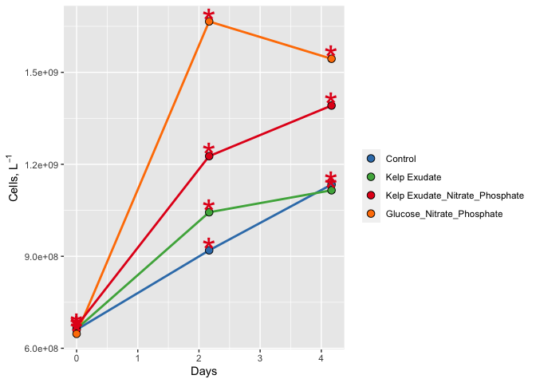
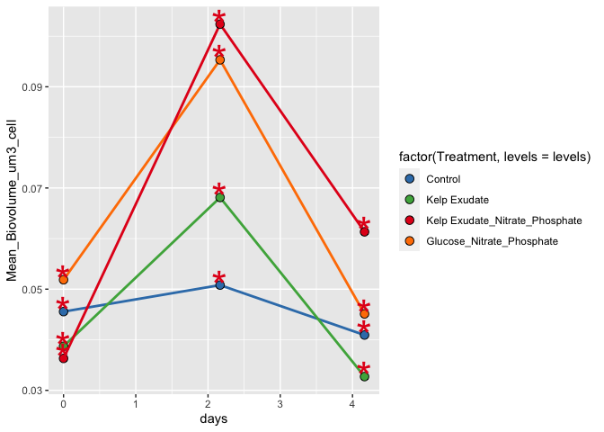

2021\_dapi\_abundance submission
================
Sammy Chan
10/27/2021

# Goal

This document shows how **individual bottle** bacterial abundance data
from 2021 remineralization experiments were processed, QC’d and
analyzed.

Load packages that we’ll need to analyze our data.

``` r
library(tidyverse)
library(readxl)
library(lubridate)
```

# Import Data

``` r
excel_sheets("~/test project/EEMB 144L/144l_students_2021/Input_Data/week4/144L_2021_BactAbund.xlsx")
```

    ## [1] "Metadata"  "FCM_Data"  "DAPI_Data"

``` r
metadata <- read_excel("~/test project/EEMB 144L/144l_students_2021/Input_Data/week4/144L_2021_BactAbund.xlsx", sheet = "Metadata")

glimpse(metadata)
```

    ## Rows: 80
    ## Columns: 16
    ## $ Experiment           <chr> "144L_2021", "144L_2021", "144L_2021", "144L_2021…
    ## $ Location             <chr> "Goleta Pier", "Goleta Pier", "Goleta Pier", "Gol…
    ## $ Temperature          <dbl> 19, 19, 19, 19, 19, 19, 19, 19, 19, 19, 19, 19, 1…
    ## $ Depth                <dbl> 1, 1, 1, 1, 1, 1, 1, 1, 1, 1, 1, 1, 1, 1, 1, 1, 1…
    ## $ Bottle               <chr> "A", "A", "A", "A", "A", "A", "A", "A", "A", "A",…
    ## $ Timepoint            <dbl> 0, 1, 2, 3, 4, 5, 6, 7, 8, 9, 0, 1, 2, 3, 4, 5, 6…
    ## $ Treatment            <chr> "Control", "Control", "Control", "Control", "Cont…
    ## $ Target_DOC_Amendment <dbl> 0, 0, 0, 0, 0, 0, 0, 0, 0, 0, 0, 0, 0, 0, 0, 0, 0…
    ## $ Inoculum_L           <dbl> 2, 2, 2, 2, 2, 2, 2, 2, 2, 2, 2, 2, 2, 2, 2, 2, 2…
    ## $ Media_L              <dbl> 5, 5, 5, 5, 5, 5, 5, 5, 5, 5, 5, 5, 5, 5, 5, 5, 5…
    ## $ Datetime             <chr> "2021-10-04T16:00", "2021-10-05T08:00", "2021-10-…
    ## $ TOC_Sample           <lgl> TRUE, FALSE, FALSE, FALSE, TRUE, FALSE, FALSE, FA…
    ## $ Cell_Sample          <lgl> TRUE, TRUE, TRUE, TRUE, TRUE, TRUE, TRUE, TRUE, T…
    ## $ DAPI_Sample          <lgl> TRUE, FALSE, FALSE, FALSE, TRUE, FALSE, FALSE, FA…
    ## $ DNA_Sample           <lgl> TRUE, FALSE, FALSE, FALSE, TRUE, FALSE, FALSE, FA…
    ## $ Nutrient_Sample      <lgl> TRUE, FALSE, FALSE, FALSE, FALSE, FALSE, FALSE, F…

``` r
dapi_data <- read_excel("~/test project/EEMB 144L/144l_students_2021/Input_Data/week4/144L_2021_BactAbund.xlsx", sheet = "DAPI_Data")
glimpse(dapi_data)
```

    ## Rows: 12
    ## Columns: 6
    ## $ Treatment                <chr> "Control", "Control", "Control", "Kelp Exudat…
    ## $ Timepoint                <dbl> 0, 4, 8, 0, 4, 8, 0, 4, 8, 0, 4, 8
    ## $ Cells_mL                 <dbl> 660667.0, 919405.6, 1133869.7, 663088.1, 1043…
    ## $ Cells_mL_Stdev           <dbl> 73217.76, 363326.27, 99930.05, 113546.27, 181…
    ## $ Mean_Biovolume_um3_cell  <dbl> 0.04556209, 0.05080353, 0.04093212, 0.0387149…
    ## $ Biovolume_Stdev_um3_cell <dbl> 0.006054805, 0.011000369, 0.004684495, 0.0054…

``` r
dapi_metadata <- metadata %>%
  select(-Bottle) %>%
  unique()
glimpse(dapi_metadata)
```

    ## Rows: 40
    ## Columns: 15
    ## $ Experiment           <chr> "144L_2021", "144L_2021", "144L_2021", "144L_2021…
    ## $ Location             <chr> "Goleta Pier", "Goleta Pier", "Goleta Pier", "Gol…
    ## $ Temperature          <dbl> 19, 19, 19, 19, 19, 19, 19, 19, 19, 19, 19, 19, 1…
    ## $ Depth                <dbl> 1, 1, 1, 1, 1, 1, 1, 1, 1, 1, 1, 1, 1, 1, 1, 1, 1…
    ## $ Timepoint            <dbl> 0, 1, 2, 3, 4, 5, 6, 7, 8, 9, 0, 1, 2, 3, 4, 5, 6…
    ## $ Treatment            <chr> "Control", "Control", "Control", "Control", "Cont…
    ## $ Target_DOC_Amendment <dbl> 0, 0, 0, 0, 0, 0, 0, 0, 0, 0, 10, 10, 10, 10, 10,…
    ## $ Inoculum_L           <dbl> 2, 2, 2, 2, 2, 2, 2, 2, 2, 2, 2, 2, 2, 2, 2, 2, 2…
    ## $ Media_L              <dbl> 5, 5, 5, 5, 5, 5, 5, 5, 5, 5, 5, 5, 5, 5, 5, 5, 5…
    ## $ Datetime             <chr> "2021-10-04T16:00", "2021-10-05T08:00", "2021-10-…
    ## $ TOC_Sample           <lgl> TRUE, FALSE, FALSE, FALSE, TRUE, FALSE, FALSE, FA…
    ## $ Cell_Sample          <lgl> TRUE, TRUE, TRUE, TRUE, TRUE, TRUE, TRUE, TRUE, T…
    ## $ DAPI_Sample          <lgl> TRUE, FALSE, FALSE, FALSE, TRUE, FALSE, FALSE, FA…
    ## $ DNA_Sample           <lgl> TRUE, FALSE, FALSE, FALSE, TRUE, FALSE, FALSE, FA…
    ## $ Nutrient_Sample      <lgl> TRUE, FALSE, FALSE, FALSE, FALSE, FALSE, FALSE, F…

``` r
joined <-  left_join(dapi_metadata, dapi_data) 
```

    ## Joining, by = c("Timepoint", "Treatment")

Complete: prepare data, plot growth curves for Cells\_L and Cell
Biovolume data AND identify exponential growth (same as previous
assignment now with the new data).

# Prepare Data

Convert the Date and Time column values from characters to dates, add
columns with time elapsed for each treatment, and convert to cells/L
because it will help us match up with the TOC data later. Also drop NA
values.

``` r
cells <- joined %>% 
  mutate(Datetime = ymd_hm(Datetime), #splits apart Datetime as specified: years, months, days _ hours, minutes
         cells_L = as.numeric(Cells_mL) *1000) %>% 
  group_by(Treatment) %>%
#group our dataset so that we can calculate the time elapsed properly; group by date first then by bottle
mutate(interv= interval(first(Datetime), Datetime),
       s = as.numeric(interv),
       hours = s/3600,
       days = hours/24) %>%
  ungroup() %>%
  select(Experiment:DNA_Sample, cells_L, hours, days) %>% 
  drop_na(cells_L)
          glimpse(cells)
```

    ## Rows: 12
    ## Columns: 17
    ## $ Experiment           <chr> "144L_2021", "144L_2021", "144L_2021", "144L_2021…
    ## $ Location             <chr> "Goleta Pier", "Goleta Pier", "Goleta Pier", "Gol…
    ## $ Temperature          <dbl> 19, 19, 19, 19, 19, 19, 19, 19, 19, 19, 19, 19
    ## $ Depth                <dbl> 1, 1, 1, 1, 1, 1, 1, 1, 1, 1, 1, 1
    ## $ Timepoint            <dbl> 0, 4, 8, 0, 4, 8, 0, 4, 8, 0, 4, 8
    ## $ Treatment            <chr> "Control", "Control", "Control", "Kelp Exudate", …
    ## $ Target_DOC_Amendment <dbl> 0, 0, 0, 10, 10, 10, 10, 10, 10, 10, 10, 10
    ## $ Inoculum_L           <dbl> 2, 2, 2, 2, 2, 2, 2, 2, 2, 2, 2, 2
    ## $ Media_L              <dbl> 5, 5, 5, 5, 5, 5, 5, 5, 5, 5, 5, 5
    ## $ Datetime             <dttm> 2021-10-04 16:00:00, 2021-10-06 20:00:00, 2021-10…
    ## $ TOC_Sample           <lgl> TRUE, TRUE, TRUE, TRUE, TRUE, TRUE, TRUE, TRUE, T…
    ## $ Cell_Sample          <lgl> TRUE, TRUE, TRUE, TRUE, TRUE, TRUE, TRUE, TRUE, T…
    ## $ DAPI_Sample          <lgl> TRUE, TRUE, TRUE, TRUE, TRUE, TRUE, TRUE, TRUE, T…
    ## $ DNA_Sample           <lgl> TRUE, TRUE, TRUE, TRUE, TRUE, TRUE, TRUE, TRUE, T…
    ## $ cells_L              <dbl> 660667000, 919405583, 1133869724, 663088109, 1043…
    ## $ hours                <dbl> 0, 52, 100, 0, 52, 100, 0, 52, 100, 0, 52, 100
    ## $ days                 <dbl> 0.000000, 2.166667, 4.166667, 0.000000, 2.166667…

# Plot Growth Curves

Plot growth curves for each treatment using DAPI cell abundance and
biovolume data.

## Cell Abundance Growth Curve

``` r
#assign hex colors to our different treatments
custom.colors <- c("Control" = "#377EB8", "Kelp Exudate" = "#4DAF4A", "Kelp Exudate_Nitrate_Phosphate" = "#E41A1C", "Glucose_Nitrate_Phosphate" = "#FF7F00")

#assign levels to control what order things appear in the legend 
levels <- c("Control", "Kelp Exudate", "Kelp Exudate_Nitrate_Phosphate", "Glucose_Nitrate_Phosphate")

#now let's use a handy package, ggplot to visualize our data

cells %>% 
  mutate(dna = ifelse(DNA_Sample == T, "*", NA)) %>%
  ggplot(aes(x=days, y=cells_L, group = interaction(Treatment))) + 
  geom_line(aes(color = factor(Treatment, levels= levels)), size = 1)+
  geom_point(aes(fill = factor(Treatment, levels = levels)), size = 3, color = "black", shape = 21) +
  geom_text(aes(label = dna), size = 12, color = "#E41A1C") +
  labs(x= "Days", y= expression(paste("Cells, L"^-1)), fill = "") + 
  guides(color = "none") +
  scale_color_manual(values = custom.colors) + 
  scale_fill_manual(values = custom.colors)
```

<!-- -->

``` r
  #facet_grid(rows = "Treatment", scales = free)
```

Q: What differences between the treatments do you observe? Does this
make sense in the context of the oxygen drawdown data (pictured below)?

A: GNP treatment had the highest cell abundance while the kelp exudate
treatment had the lowest. This makes sense because the GNP treatment had
the most cells, therefore, they consume the most oxygen (matches oxygen
drawdown data). However, while the kelp treatment consumed the second
most amount of oxygen, it still had the lowest cell abundance.

Oxygen Drawdown:


## Cell Biovolume Growth Curve

``` r
cells <- joined %>% 
  mutate(Datetime = ymd_hm(Datetime), #splits apart Datetime as specified: years, months, days _ hours, minutes
         cells_L = as.numeric(Cells_mL) *1000) %>% 
  group_by(Treatment) %>%
#group our dataset so that we can calculate the time elapsed properly; group by date first then by bottle
mutate(interv= interval(first(Datetime), Datetime),
       s = as.numeric(interv),
       hours = s/3600,
       days = hours/24) %>%
  ungroup() %>%
  drop_na(cells_L)
          glimpse(cells)
```

    ## Rows: 12
    ## Columns: 24
    ## $ Experiment               <chr> "144L_2021", "144L_2021", "144L_2021", "144L_…
    ## $ Location                 <chr> "Goleta Pier", "Goleta Pier", "Goleta Pier", …
    ## $ Temperature              <dbl> 19, 19, 19, 19, 19, 19, 19, 19, 19, 19, 19, 19
    ## $ Depth                    <dbl> 1, 1, 1, 1, 1, 1, 1, 1, 1, 1, 1, 1
    ## $ Timepoint                <dbl> 0, 4, 8, 0, 4, 8, 0, 4, 8, 0, 4, 8
    ## $ Treatment                <chr> "Control", "Control", "Control", "Kelp Exudat…
    ## $ Target_DOC_Amendment     <dbl> 0, 0, 0, 10, 10, 10, 10, 10, 10, 10, 10, 10
    ## $ Inoculum_L               <dbl> 2, 2, 2, 2, 2, 2, 2, 2, 2, 2, 2, 2
    ## $ Media_L                  <dbl> 5, 5, 5, 5, 5, 5, 5, 5, 5, 5, 5, 5
    ## $ Datetime                 <dttm> 2021-10-04 16:00:00, 2021-10-06 20:00:00, 202…
    ## $ TOC_Sample               <lgl> TRUE, TRUE, TRUE, TRUE, TRUE, TRUE, TRUE, TRU…
    ## $ Cell_Sample              <lgl> TRUE, TRUE, TRUE, TRUE, TRUE, TRUE, TRUE, TRU…
    ## $ DAPI_Sample              <lgl> TRUE, TRUE, TRUE, TRUE, TRUE, TRUE, TRUE, TRU…
    ## $ DNA_Sample               <lgl> TRUE, TRUE, TRUE, TRUE, TRUE, TRUE, TRUE, TRU…
    ## $ Nutrient_Sample          <lgl> TRUE, FALSE, FALSE, TRUE, FALSE, FALSE, TRUE,…
    ## $ Cells_mL                 <dbl> 660667.0, 919405.6, 1133869.7, 663088.1, 104…
    ## $ Cells_mL_Stdev           <dbl> 73217.76, 363326.27, 99930.05, 113546.27, 181…
    ## $ Mean_Biovolume_um3_cell  <dbl> 0.04556209, 0.05080353, 0.04093212, 0.0387149…
    ## $ Biovolume_Stdev_um3_cell <dbl> 0.006054805, 0.011000369, 0.004684495, 0.0054…
    ## $ cells_L                  <dbl> 660667000, 919405583, 1133869724, 663088109, …
    ## $ interv                   <Interval> 2021-10-04 16:00:00 UTC--2021-10-04 16:00:00 …
    ## $ s                        <dbl> 0, 187200, 360000, 0, 187200, 360000, 0, 1872…
    ## $ hours                    <dbl> 0, 52, 100, 0, 52, 100, 0, 52, 100, 0, 52, 100
    ## $ days                     <dbl> 0.000000, 2.166667, 4.166667, 0.000000, 2.166…

``` r
#assign hex colors to our different treatments
custom.colors <- c("Control" = "#377EB8", "Kelp Exudate" = "#4DAF4A", "Kelp Exudate_Nitrate_Phosphate" = "#E41A1C", "Glucose_Nitrate_Phosphate" = "#FF7F00")

#assign levels to control what order things appear in the legend 
levels <- c("Control", "Kelp Exudate", "Kelp Exudate_Nitrate_Phosphate", "Glucose_Nitrate_Phosphate")

#now let's use a handy package, ggplot to visualize our data

cells %>% 
  mutate(dna = ifelse(DNA_Sample == T, "*", NA)) %>%
  ggplot(aes(x=days, y=Mean_Biovolume_um3_cell, group = interaction(Treatment))) + 
  geom_line(aes(color = factor(Treatment, levels= levels)), size = 1)+
  geom_point(aes(fill = factor(Treatment, levels = levels)), size = 3, color = "black", shape = 21) +
  geom_text(aes(label = dna), size = 12, color = "#E41A1C") +
  guides(color = "none") +
  scale_color_manual(values = custom.colors) + 
  scale_fill_manual(values = custom.colors)
```

<!-- -->

``` r
  #facet_grid(rows = "Treatment", scales = free)
```

Q: What differences do you notice between the cell abundance data and
the cell biovolume data?

A: We can see that the GNP treatment actually had the highest mean
biovolume while kelp exudate treatment had the lowest mean biovolume.
This might help explain some contradictions within the first plot. It is
possible that there is difference in cell size. For example if grazing
is occurring in the kelp exudate treatment, the grazing bacterioplankton
might be selectively grazing on the larger bacteria, leaving the small
bacterioplankton to consume the majority of O2.
